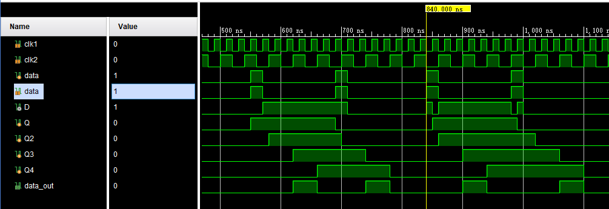

#	Test404测试记录

## 2020.4.4  单bit快时钟跨到慢时钟域信号处理

### 一、Verilog代码

`timescale 1ns / 1ps

//////////////////////////////////////////////////////////////////////////////////

// Company: 

// Engineer: 

// 

// Create Date: 2020/04/04 18:54:26

// Design Name: 

// Module Name: Test_top

// Project Name: 

// Target Devices: 

// Tool Versions: 

// Description: 

// 

// Dependencies: 

// 

// Revision:

// Revision 0.01 - File Created

// Additional Comments:

// 

//////////////////////////////////////////////////////////////////////////////////

module Test_top(//快转慢单bit信号仿真测试

​    input clk1,//fast clk 50m

​    input clk2,//slow clk 25m

​    input data,

​    output data_out

​    );

​    wire D;// D=1'b0;

​    reg Q=1'b0,Q2=1'b0,Q3=1'b0,Q4=1'b0;

​    always @(posedge clk1) begin

​        Q <= D;

​    end

​    always @(posedge clk2) begin

​        Q2 <= Q;

​        Q3 <= Q2;

​        Q4 <= Q3;

​    end

​    // always @(data or D or Q) begin

​    //     if (data==1'b0) begin

​    //         D = Q;

​    //     end else begin

​    //         D = ~Q;

​    //     end

​    // end

assign D =(data==1'b1)?(~Q):Q;

​    assign data_out = (Q4 & (~Q3)) | ((~Q4) & Q3);

endmodule 

### 二、仿真代码

`timescale 1ns / 1ps

//////////////////////////////////////////////////////////////////////////////////

// Company: 

// Engineer: 

// 

// Create Date: 2020/04/04 18:55:42

// Design Name: 

// Module Name: tb_Test_top

// Project Name: 

// Target Devices: 

// Tool Versions: 

// Description: 

// 

// Dependencies: 

// 

// Revision:

// Revision 0.01 - File Created

// Additional Comments:

// 

//////////////////////////////////////////////////////////////////////////////////

module tb_Test_top();

// reg rst_n;

reg clk1 = 1'b0;

reg clk2 = 1'b0;

reg data = 1'b0;

initial

begin

​       #130

​       data=1'b1;

​       #20

​       data=1'b0;

​       #120

​       data=1'b1;

​       #20

​       data=1'b0;

end

initial begin

​    forever clk1 = #(20/2) ~ clk1;//50m

end

initial begin

​    forever clk2 = #(40/2) ~ clk2;//20m

​    

end

Test_top Test_1bit_sync(

​    .clk1(clk1),//fast clk 50m

​    .clk2(clk2),//slow clk 25m

​    .data(data)

​    // .data_out

);

endmodule

### 三、仿真结果

